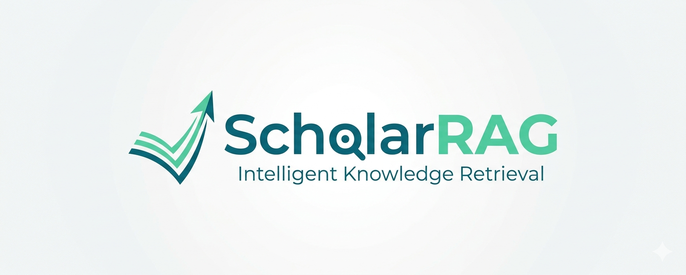

<div align="center">
</div>

---
<!-- TODO: replace with actual diagram -->
<p align="center">
  
</p>
# ScholarRAG

**Multi-Agent RAG System for Academic Paper Q&A**

Upload academic papers, ask questions in natural language, get grounded answers with precise citations.


[Quick Start](#quick-start) | [Features](#features) | [Architecture](#architecture) | [API Reference](#api-reference)


## What is ScholarRAG?

ScholarRAG is an end-to-end academic paper Q&A system. It parses PDFs with full structural awareness (sections, tables, figures), retrieves relevant passages via hybrid search, and generates cited answers through a multi-agent pipeline -- all accessible through a clean chat interface.

**Key highlights:**

- Multi-agent query decomposition with parallel retrieval and self-reflection
- Hybrid BM25 + dense retrieval with cross-encoder reranking
- Structured PDF parsing preserving section hierarchy, tables, and captions
- Source-level citations with paper, section, and page references
- Multi-turn conversation with memory compression

**Who is this for?**

This project is beginner-friendly and well-suited for anyone looking to learn and practice the full Agentic RAG workflow -- from PDF ingestion, hybrid retrieval, to multi-agent orchestration with LangGraph. The codebase is modular, well-decoupled, and easy to follow, making it an ideal starting point for students and developers exploring RAG system design.

---

## Features

<!-- TODO: replace with actual screenshot or GIF -->
<p align="center">
  
</p>

| Category | Details |
|---|---|
| **Retrieval** | BM25 + dense embedding fusion (RRF), cross-encoder reranking, parent-child chunk expansion |
| **PDF Parsing** | Docling-based with section hierarchy, table linearization, figure/caption linking |
| **Agent** | LangGraph multi-agent: query decomposition -> parallel sub-agents -> synthesis |
| **Reflection** | Sub-agents self-evaluate sufficiency, retry with refined queries |
| **Memory** | Sliding window + LLM summary compression for multi-turn context |
| **Streaming** | SSE real-time streamed responses |
| **Citations** | Auto-generated source references (paper, section, page) |
| **Evaluation** | Built-in RAGAS metrics: Faithfulness, Relevancy, Precision, Correctness |

---

## Architecture

<!-- TODO: replace with actual diagram -->
<p align="center">
  
</p>

---

## Project Structure

```
backend/
  app/            FastAPI application (routers, dependencies, session store)
  agent/          LangGraph multi-agent (graph, nodes, states, prompts)
  rag/            Retrieval pipeline (hybrid search, reranker, PDF parser, citations)
  eval/           RAGAS & retrieval evaluation scripts
  config.py       Environment-based configuration

frontend/
  src/
    App.jsx       Main layout (sidebar + chat + panels)
    api.js        API client (fetch + SSE streaming)
    components/   Sidebar, ChatMessages, ChatInput, FileUpload, SettingsPanel
```

---

## Quick Start

### Prerequisites

- Python 3.12+
- Node.js 18+
- [Milvus 2.x](https://milvus.io/docs/install_standalone-docker.md) running on `localhost:19530`
- A vLLM / Ollama / OpenAI-compatible LLM endpoint

### 1. Backend

```bash
cd backend
cp .env.example .env    # edit with your model paths and endpoints
pip install -r requirements.txt
python -m uvicorn app.main:app --host 0.0.0.0 --port 8000
```

### 2. Frontend

```bash
cd frontend
npm install
npm run dev             # dev mode at http://localhost:5173
# or
npm run build           # production build, served by backend at /
```

### 3. Use

1. Open the app in your browser
2. Upload PDF papers via the upload panel
3. Ask questions -- get cited answers in seconds

---

## Configuration

All settings via `backend/.env`:

| Variable | Default | Description |
|---|---|---|
| `MILVUS_URI` | `http://localhost:19530` | Milvus connection URI |
| `COLLECTION_NAME` | `papers` | Collection name prefix |
| `EMBEDDING_MODEL` | `BAAI/bge-small-en-v1.5` | Embedding model path |
| `RERANKER_MODEL` | `BAAI/bge-reranker-v2-m3` | Reranker model path |
| `LLM_BASE_URL` | `http://localhost:8848/v1` | LLM endpoint (OpenAI-compatible) |
| `LLM_MODEL` | `Qwen3.5-9B` | Model name |
| `LLM_TEMPERATURE` | `0.1` | Generation temperature |
| `TOP_K` | `5` | Retrieved documents per query |
| `FETCH_K` | `20` | Candidates before reranking |
| `MAX_RETRIES` | `0` | Reflection retry limit |

---

## API Reference

| Method | Endpoint | Description |
|---|---|---|
| `POST` | `/api/chat` | SSE streaming chat (`{query, session_id?}`) |
| `GET` | `/api/sessions` | List sessions |
| `GET` | `/api/sessions/:id/history` | Conversation history |
| `DELETE` | `/api/sessions/:id` | Delete session |
| `POST` | `/api/files/upload` | Upload PDFs (multipart) |
| `GET` | `/api/files` | List uploaded files |
| `DELETE` | `/api/files/:id` | Delete file + vectors |
| `DELETE` | `/api/collection` | Clear vector database |
| `GET` | `/api/health` | Health check |

---

## Evaluation

```bash
cd backend

# Retrieval: Recall@k, Precision@k, MRR, MAP
python eval/eval_retrieval.py

# Generation: RAGAS (Faithfulness, Relevancy, Precision, Correctness)
python eval/eval_generation.py
```

---

## Tech Stack

| Layer | Technology |
|---|---|
| LLM Orchestration | LangGraph, LangChain |
| Vector Database | Milvus 2.x (BM25 + dense hybrid) |
| PDF Parsing | Docling |
| Reranking | BGE Reranker v2 (CrossEncoder) |
| Backend | FastAPI, SSE-Starlette, Uvicorn |
| Frontend | React 18, TailwindCSS, Vite |
| Evaluation | RAGAS |

---


## License

MIT
